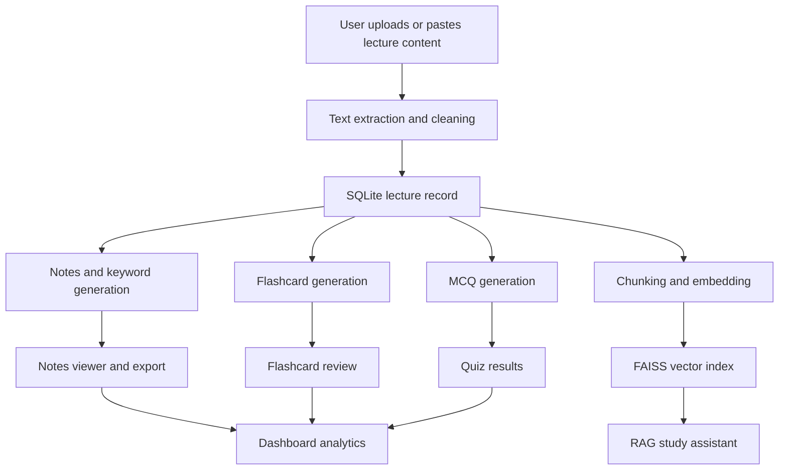

# LectureMind AI 📚

LectureMind AI is a Streamlit-based study companion that turns lecture files into structured notes, flashcards, multiple-choice quizzes, exports, analytics, and a searchable study assistant.

The project is built as a local-first learning tool: uploaded files are processed on the user's machine, extracted text is stored in SQLite, and retrieval indexes are generated on demand for question answering.

## ✨ Features

- 📤 Upload PDF, PPTX, or TXT lecture material
- 📝 Paste raw lecture notes or transcripts directly into the app
- 🧠 Generate concise summaries and keyword lists
- 📇 Create flashcards for active recall practice
- ✅ Build MCQ quizzes with score tracking
- 🔎 Ask lecture-specific questions with a RAG-based study assistant
- 📊 View progress and quiz analytics from the dashboard
- 📄 Export generated notes as PDF or DOCX files
- 🎨 Streamlit multipage interface with a custom dark theme

## 🧱 Tech Stack

- **Frontend:** Streamlit
- **Data storage:** SQLite
- **Charts:** Plotly, Pandas
- **Document parsing:** pdfplumber, python-pptx
- **NLP models:** Transformers, Sentence Transformers, KeyBERT
- **Retrieval:** FAISS vector indexes
- **Exports:** python-docx, fpdf2

## 🗂️ Project Structure

```text
LectureMindAI_Phase6_Integrated/
├── app.py                         # Main Streamlit entry page
├── pages/                         # Streamlit multipage views
│   ├── 1_Dashboard.py
│   ├── 2_Upload_Lecture.py
│   ├── 3_Notes_Generator.py
│   ├── 4_Notes_Viewer.py
│   ├── 5_Flashcards.py
│   ├── 6_MCQ_Quiz.py
│   └── 8_AI_Study_Assistant.py
├── database/                      # SQLite helpers and schema
│   ├── database.py
│   └── schema.sql
├── models/                        # Summarization, keywords, quizzes, RAG
├── services/                      # File parsing, exports, cleaning, logging
├── utils/                         # Shared UI styling helpers
├── .streamlit/config.toml         # Streamlit theme configuration
├── requirements.txt
└── README.md
```

Runtime folders such as `uploads/`, `generated/`, `logs/`, `database/*.db`, and `vectorstore/` are intentionally ignored because they contain local user data or generated artifacts.

## 🏗️ Architecture



### Main Flow

1. The user uploads a lecture file or pastes lecture text.
2. The app extracts text, removes common artifacts, and stores lecture metadata.
3. Notes, keywords, flashcards, and MCQs are generated from the cleaned content.
4. The RAG engine chunks lecture text, builds embeddings, and saves a FAISS index.
5. The dashboard and study pages read from SQLite to show progress and results.

## 🖼️ Screenshots

Add screenshots to `docs/screenshots/` and update the image paths below.

### Dashboard


### Upload Lecture


### Notes Generator


### Flashcards


### MCQ Quiz


### AI Study Assistant


## ⚙️ Installation

Create and activate a virtual environment:

```bash
python -m venv venv
```

On Windows:

```bash
venv\Scripts\activate
```

On macOS/Linux:

```bash
source venv/bin/activate
```

Install dependencies:

```bash
pip install -r requirements.txt
```

## 🚀 Running the App

Start the Streamlit app:

```bash
streamlit run app.py
```

Then open the local URL shown in the terminal, usually:

```text
http://localhost:8501
```

## 🧪 Usage

1. Open **Upload Lecture** and upload a PDF, PPTX, TXT file, or paste lecture text.
2. Go to **Notes Generator** and generate a summary, keywords, and the knowledge base.
3. Review generated content in **Notes Viewer**.
4. Practice with **Flashcards** and **MCQ Quiz**.
5. Ask lecture-specific questions in **AI Study Assistant**.
6. Track progress from the **Dashboard**.

## 🗃️ Data and Generated Files

The app creates local runtime files while it is being used:

- `database/lecturemind.db` stores lectures, notes, flashcards, MCQs, and quiz results.
- `uploads/` stores uploaded source files and extracted text.
- `vectorstore/faiss_index/` stores generated FAISS indexes.
- `vectorstore/metadata/` stores chunk metadata for retrieval.
- `generated/` stores exported files.
- `logs/` stores application logs.

These files are ignored by Git because they are local outputs, not source code.

## 🔐 Privacy Notes

Lecture files, extracted text, generated notes, and vector indexes are stored locally in the project workspace. Avoid committing private lecture files, exported notes, local databases, or generated indexes to a public repository.

## 🛠️ Maintenance

Useful checks while developing:

```bash
git status
```

```bash
python -m compileall .
```

```bash
streamlit run app.py
```

## 📌 Roadmap

- Add screenshot assets for the README
- Add unit tests for text cleaning and generator helpers
- Add optional database reset tools for demos
- Add model configuration from environment variables
- Add deployment notes for Streamlit Community Cloud

## 📄 License

Add a license file before publishing or distributing the project.
