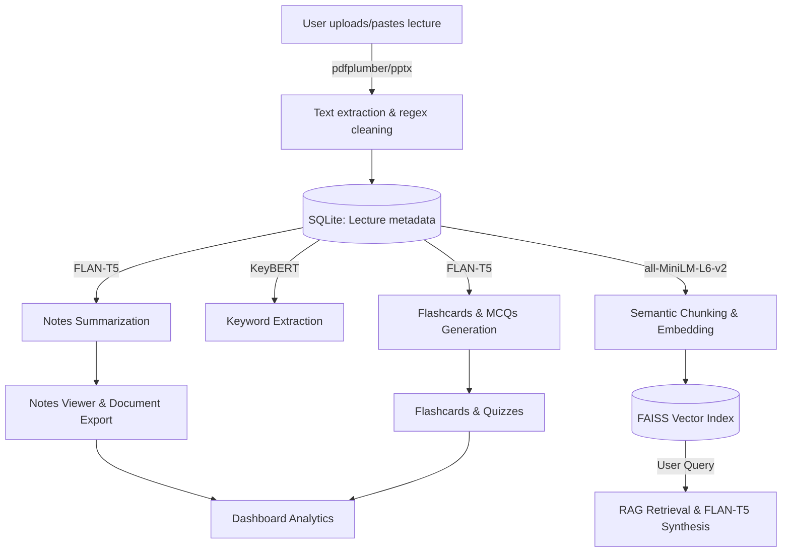

# LectureMind AI 📚

LectureMind AI is a local-first, Streamlit-based study companion that transforms lecture files (PDF, PPTX, TXT) into structured notes, flashcards, multiple-choice quizzes, exports, analytics, and a searchable Retrieval-Augmented Generation (RAG) study assistant.

Built for privacy and cost-efficiency, the project relies entirely on local NLP inference using Hugging Face Transformers, Sentence Transformers, and FAISS. No external API calls are made, meaning all lecture data remains completely private.

## ✨ Key Features

- **Multi-format Ingestion:** Upload PDF, PPTX, or TXT lecture materials, or paste raw text.
- **Local LLM Summarization:** Generates clean, bullet-point summaries using instruction-tuned `flan-t5-base`.
- **Keyword Extraction:** Uses `KeyBERT` to identify the most critical concepts in the text.
- **Automated Study Tools:**
  - **Flashcards:** Extracts Q&A pairs for active recall.
  - **MCQ Quizzes:** Generates multiple-choice questions with model-generated distractors.
- **RAG Study Assistant:** A local AI tutor powered by FAISS vector search and `flan-t5-base` for synthesizing answers to lecture-specific questions.
- **Progress Tracking:** A dashboard with interactive Plotly charts tracking lectures uploaded, notes generated, and quiz scores.
- **Document Export:** Export generated notes as cleanly formatted PDF or DOCX files.
- **Premium UI:** A fully custom Streamlit dark-mode UI with glassmorphic cards, CSS animations, and polished layouts.

## 📸 Screenshots

*(Add your screenshots here! For example: ``)*

- **Dashboard:** Interactive analytics and progress tracking.
- **Upload & Generate:** Seamless file ingestion and AI processing.
- **Notes Viewer:** Clean reading interface with export options.
- **Flashcards & Quizzes:** Interactive active recall tools.
- **AI Study Assistant:** Chat interface powered by local RAG.

## 🧱 Tech Stack & Architecture

This application is built with a focus on local-first processing, combining modern Python data science tools with local NLP inference to ensure data privacy and zero API costs.

### Core Framework & Data
- **[Streamlit](https://streamlit.io/):** Powers the responsive, multipage frontend. Custom CSS is injected via `st.html()` to bypass Streamlit's default sanitization, allowing for a highly premium, Tailwind-inspired UI.
- **[SQLite](https://www.sqlite.org/):** Lightweight, file-based relational database (`database/lecturemind.db`) used to persistently store lecture metadata, generated notes, flashcards, MCQs, and quiz results.
- **[Pandas](https://pandas.pydata.org/) & [Plotly](https://plotly.com/python/):** Used in the Dashboard for data aggregation and interactive visualizations (e.g., gauge charts, progress bars).

### Document Parsing & Export
- **[pdfplumber](https://github.com/jsvine/pdfplumber):** Extracts raw text from uploaded PDF documents.
- **[python-pptx](https://python-pptx.readthedocs.io/):** Extracts text from PowerPoint slide decks.
- **[fpdf2](https://pyfpdf.github.io/fpdf2/) & [python-docx](https://python-docx.readthedocs.io/):** Dynamically generates downloadable PDF and DOCX files from the AI-generated study notes.

### NLP & Machine Learning (Local Inference)
- **[PyTorch](https://pytorch.org/) & [Hugging Face Transformers](https://huggingface.co/docs/transformers/index):** Underpins the local LLM generation. Uses lightweight Seq2Seq models (`google/flan-t5-base`) for summarization, MCQ generation, and QA synthesis.
- **[KeyBERT](https://maartengr.github.io/KeyBERT/):** A minimal keyword extraction tool leveraging BERT embeddings to find the most representative sub-phrases in a document.
- **[Sentence Transformers](https://www.sbert.net/):** Computes dense vector embeddings (`all-MiniLM-L6-v2`) for lecture chunks to enable semantic search.
- **[FAISS](https://faiss.ai/) (Facebook AI Similarity Search):** Provides highly efficient, in-memory CPU vector indexing (`faiss.IndexFlatIP` with L2 normalization for cosine similarity) and nearest-neighbor search for the RAG pipeline.
- **[NLTK](https://www.nltk.org/):** Used for robust sentence tokenization (`punkt`) prior to semantic chunking.

## 🗂️ Project Structure

```text
LectureMindAI_Phase6_Integrated/
├── app.py                         # Main Streamlit entry page
├── pages/                         # Streamlit multipage views
│   ├── 1_Dashboard.py             # User stats and Plotly charts
│   ├── 2_Upload_Lecture.py        # File upload and text extraction
│   ├── 3_Notes_Generator.py       # Triggers AI models (Summaries, RAG indexing)
│   ├── 4_Notes_Viewer.py          # Displays notes and handles PDF/DOCX exports
│   ├── 5_Flashcards.py            # Flashcard review UI
│   ├── 6_MCQ_Quiz.py              # Interactive quiz UI
│   └── 8_AI_Study_Assistant.py    # Chat interface for the RAG engine
├── database/
│   ├── database.py                # SQLite CRUD operations
│   └── schema.sql                 # Database table definitions
├── models/
│   ├── flashcard_generator.py     # Wrapper for flashcard logic
│   ├── keyword_extractor.py       # KeyBERT implementation
│   ├── mcq_generator.py           # FLAN-T5 logic for generating questions & distractors
│   ├── rag_engine.py              # FAISS indexing and semantic search + FLAN-T5 synthesis
│   └── summarizer.py              # FLAN-T5 instruction-tuned summarization
├── services/
│   ├── export_docx.py             # python-docx export logic
│   ├── export_pdf.py              # fpdf2 export logic
│   ├── pdf_processor.py           # pdfplumber extraction
│   ├── ppt_processor.py           # python-pptx extraction
│   └── text_cleaner.py            # Regex-based text normalization
├── utils/
│   └── styles.py                  # Shared custom CSS injected via st.html()
├── .streamlit/config.toml         # Streamlit theme configuration
├── requirements.txt               # Project dependencies
└── README.md                      # Project documentation
```

*Note: Runtime folders such as `uploads/`, `generated/`, `logs/`, `database/*.db`, and `vectorstore/` are intentionally ignored by Git because they contain local user data or generated artifacts.*

## 🏗️ Architecture & Data Flow



### The RAG Pipeline Deep Dive
1. **Chunking:** Extracted text is tokenized into sentences via NLTK, then grouped into overlapping chunks (max 150 words, 2-sentence overlap) to preserve context.
2. **Embedding:** Chunks are embedded into dense vectors using `all-MiniLM-L6-v2` and L2-normalized.
3. **Indexing:** Vectors are stored in a `FAISS IndexFlatIP` index on disk (`vectorstore/faiss_index/`), with corresponding raw text chunks pickled in `vectorstore/metadata/`.
4. **Retrieval & Synthesis:** User queries are embedded, and the top-K chunks are retrieved via cosine similarity. `google/flan-t5-base` then synthesizes a natural-language answer based *strictly* on the retrieved context, assigning a confidence score based on vector distance.

## ⚙️ Installation

Create and activate a virtual environment:

```bash
python -m venv venv
```

On Windows:
```bash
venv\Scripts\activate
```

On macOS/Linux:
```bash
source venv/bin/activate
```

Install dependencies:
```bash
pip install -r requirements.txt
```

## 🚀 Running the App

Start the Streamlit application:

```bash
streamlit run app.py
```

Open the local URL shown in the terminal (usually `http://localhost:8501`).

## 🧪 Usage Workflow

1. Open **Upload Lecture** and upload a PDF, PPTX, TXT file, or paste lecture text.
2. Go to **Notes Generator** to trigger the AI models (this will summarize the text, extract keywords, generate quizzes, and build the FAISS index).
3. Review the generated content in the **Notes Viewer** (and optionally export to PDF/DOCX).
4. Practice active recall with **Flashcards** and the **MCQ Quiz**.
5. Ask lecture-specific questions in the **AI Study Assistant**.
6. Track your overall study progress from the **Dashboard**.

## 🔐 Privacy & Local Execution
Because this application relies exclusively on local models (`flan-t5`, `KeyBERT`, `Sentence Transformers`), **zero data leaves your machine**. Lecture files, extracted text, generated notes, and vector indexes are processed and stored locally in your workspace.

## ⚠️ Limitations & Known Constraints

While LectureMind AI is designed to be a robust, local-first study companion, its architecture introduces a few inherent limitations:

1. **Hardware & Inference Speed:** Since all NLP models (`flan-t5-base`, `KeyBERT`, Sentence Transformers) run locally—and default to CPU execution via `faiss-cpu` and PyTorch—the speed of summarization, quiz generation, and RAG retrieval depends heavily on your machine's CPU and RAM capabilities.
2. **Model Size Trade-offs:** The `flan-t5-base` model is lightweight (approx. 250M parameters) to ensure it can run on standard consumer hardware. While highly capable for specific tasks, it does not possess the vast reasoning depth of massive commercial LLMs. It may occasionally hallucinate or generate slightly awkward MCQ distractors.
3. **Context Window Limits:** Local LLMs have strict token limits. To process lengthy lectures, the app relies on semantic chunking and RAG. Consequently, the AI Study Assistant synthesizes answers based on isolated retrieved snippets rather than holding the entire lecture in context at once.
4. **File Parsing Constraints:** Text extraction via `pdfplumber` and `python-pptx` performs best on text-heavy, standard layouts. Scanned PDFs (which require OCR) or heavily image-based slide decks will not yield extractable text, leading to poor AI generation.
5. **Database Scalability:** The application uses SQLite for zero-setup local storage. While perfect for a single-user desktop app, SQLite is not designed for high-concurrency multi-user environments. Deploying this to a cloud server for many simultaneous users may result in database locking issues.
